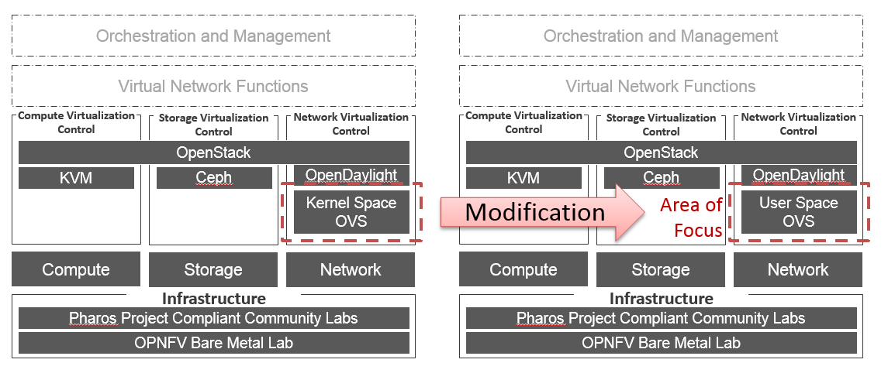

.. OPNFV - Open Platform for Network Function Virtualization
.. This work is licensed under a Creative Commons Attribution 4.0
.. International License.
.. http://creativecommons.org/licenses/by/4.0

Scenario: "OpenStack - ovs-nfv"
=============================

Scenario: apex-os-odl_l3-ovs-noha

"apex-os-odl_l3-ovs-noha" is a scenario developed as part of the OVS for NFV
OPNFV project. The main components of the "apex-os-odl_l3-ovs-noha" scenario
are:

 - APEX (TripleO) installer (please also see APEX installer documentation)
 - Openstack (in non-HA configuration)
 - OVS/DPDK Open vSwitch with DPDK data plane virtual forwarder for tenant networking
 - ODL  Open Daylight service running on a single controller

Introduction
============

NFV and virtualized high performance applications, such as video processing,
require Open vSwitch to be accelerated with a fast data plane solution that provides both
carrier grade forwarding performance, scalability and open extensibility.

A key component of any NFV solution is the virtual forwarder, which should consist of
soft switch that includes an accelerated data plane component. For this, any virtual
switch should make use of
hardware accelerators and optimized cache operation to be run in user space.

The apex-os-odl_l3-ovs-noha scenario provides
use-cases for deployment of NFV nodes instantiated by
an Openstack orchestration system on OVS/DPDK enabled compute nodes
with Open Daylight controller service.

A deployment of the "apex-os-odl_l3-ovs-noha" scenario consists of 3 or more
servers:

  * 1 Jumphost hosting the APEX installer - running the Undercloud
  * 1 Controlhost, which runs the Overcloud and Openstack services
  * and Open Daylight service
  * 1 or more Computehosts

Tenant networking leverages Open vSwitch accelerated with a fast user space data path such
as DPDK.
Open VSwitch (OVS) with the Linux kernel module data path is used for all other
connectivity, such as connectivity to public networking "the
Internet" (i.e. br-ext) is performed via non-accelerated OVS.

Features of the scenario
------------------------

Main features of the "apex-os-ovs-nosdn-noha" scenario:

  * Automated installation using the APEX installer
  * Accelerated tenant networking using OVS/DPDK as the forwarder

Networking in this scenario using OVS with accelerated User space IO.
---------------------------------------------------------------------

The apex-os-odl_l3-ovs-noha scenario combines components from three open
source projects: OpenStack, Open vSwitch and DPDK. To make accelerated networking
available for this scenario Open vSwitch is bound via its netdev interface
with DPDK user space accelerated capability.

Scenario Configuration
======================

Simply deploy this scenario by using the os-odl_l3-ovs-noha.yaml deploy
settings file.

Validated deployment environments
=================================

The "os-odl_l3-ovs-noha" scenario has been deployed and tested
on the following sets of hardware:
 * TBD

Limitations, Issues and Workarounds
===================================

* _APEX-415 br-phy dpdk interfaces are not brought up by os-net-config

References
==========

  * OVS for NFV OPNFV project wiki: https://wiki.opnfv.org/display/ovsnfv
  * Open vSwitch: http://openvswitch.org/
  * DPDK: http://dpdk.org
  * OPNFV Colorado release - more information: http://www.opnfv.org/colorado
